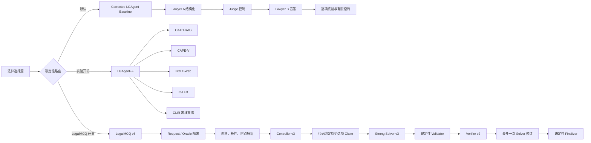

# LGAgent 全面优化与法律推理增强技术报告

> 文档日期：2026-09-12
> 当前 LegalMCQ Prompt：`legal-mcq-three-role-v5`
> 当前冻结 ID：`1931b3df9f45caf8f1c3ddc8`
> 当前离线回归：`321 passed`
> 项目定位：训练免费、可审计、可回滚的法律选择题多智能体推理系统

## 1. 文档目的

本文对 LGAgent 项目迄今完成的优化进行统一整理，回答五个问题：

1. 原始 LGAgent 已经具备什么能力；
2. 每轮修改解决了哪个流程问题；
3. 代码、配置、数据和评测体系分别发生了什么变化；
4. 为什么这些变化有可能改善法律回答，而不仅是增加 Agent 数量；
5. 哪些能力已经被工程或真实供应商验证，哪些仍不能宣称提高准确率。

本文中的“更优”分为三种不同含义，不能混用：

- **工程更优**：更少崩溃、更少截断、更可恢复、更可观测；
- **法律过程更优**：更准确地识别题意、时间、选项、证据和审查责任；
- **统计效果更优**：冻结方案后，在独立测试集上取得显著准确率提升。

前两类已有较强证据，第三类仍需正式多种子对照实验。

## 2. 项目演进总览

LGAgent 的演进不是简单叠加 Prompt，而是逐步把一个开放式多 Agent 对话系统
改造成具有显式状态、权限边界、资源预算和审计证据的法律推理系统。



当前配置将三条路线互相隔离：

- `legal_mcq.enabled: false`：不启用新三角色链路；
- `lgagent_plus.enabled: false`：不启用 OATH-RAG、CAPE-V、Web、C-LEX；
- 两个总开关不能同时开启；
- 所有实验创新默认关闭，保留为研究原型；
- 当前推荐把“稳定工程基线”和“待验证创新”分开报告。

## 3. 原始 LGAgent 的方法基础

原始 LGAgent 采用 Lawyer A、Judge、Lawyer B 三角色：

1. Lawyer A 对题目进行结构化分解；
2. Judge 决定证据需求、反例方向和是否检索；
3. Lawyer B 先在看不到上游观点时给出盲答 B0；
4. Lawyer B 再看到结构和证据，逐项输出 SUPPORT、REFUTE 或 NEI；
5. 当 NEI 比例不低于 0.5 或 B0 置信度低于 0.6 时，最多增加两轮澄清。

该设计已经包含几个重要思想：

- 先结构化、后裁决；
- 将先验答案与证据后答案分离；
- 对所有选项逐项核验，而不是只解释被选项；
- 用显式规则限制对话轮数；
- 将检索作为可选能力，而非默认给模型灌入网页内容。

README 中记录的论文结果显示，多种模型在 JEC-QA、LexGenius、CAIL2022
上使用 LGAgent 后高于 Direct 和 CoT。例如 Qwen3-4B 在 LexGenius 上的
记录为 `55.62 / 56.33 / 59.25`（Direct / CoT / LGAgent）。
论文中的抽样成本分析还记录：LGAgent 配置约为每 1000 题
`0.29-0.68` 美元，对比所评估前沿模型直接回答的 `3.16-3.37` 美元。

这些是论文已有结果。后续本地工程试验使用了不同模型、样本、供应商和配置，
不能与论文表格直接混算。

## 4. 全部优化点总表

| 编号 | 优化点 | 修改流程 | 核心收益 | 当前状态 |
|---|---|---|---|---|
| O01 | 严格 JSON 协议 | 全角色输出 | 将自由文本变成可验证状态 | 已实现 |
| O02 | Answer-neutral 角色边界 | Lawyer A / Controller | 降低上游答案锚定 | 已实现 |
| O03 | B0 盲答分离 | Lawyer B | 保留独立先验判断 | 已实现 |
| O04 | 全选项核验 | Lawyer B / Solver | 减少只为候选项找理由 | 已实现 |
| O05 | 有限澄清和修订 | 对话控制 | 防止无限循环和成本失控 | 已实现 |
| O06 | 高风险定向重检索 | LGAgent++ 高风险路径 | 针对验证缺口补证据 | 已实现、默认关闭 |
| O07 | 反事实真实接入 Runner | CAPE-V | 测试选项顺序与表面扰动稳定性 | 已实现、默认关闭 |
| O08 | 共享 BM25 与语料对象 | 实验 Runner | 避免每题重复建索引 | 已实现 |
| O09 | 全局调用/token/时间预算 | 所有模型调用 | 统一控制开销并阻断超限调用 | 已实现 |
| O10 | 可复现 seed 传递 | 所有模型调用 | 区分调用身份并记录随机性边界 | 已实现 |
| O11 | 统一领域标签 | 数据与评测 | 支持七维分析和分组校准 | 已实现 |
| O12 | OATH 三车道检索 | RAG | 同时找支持、反驳和例外 | 已实现、默认关闭 |
| O13 | 法域/权威/时效硬过滤 | RAG | 减少错误法域和失效法条 | 已实现、默认关闭 |
| O14 | Evidence Auditor | RAG 后处理 | 只允许原文片段成为证据 | 已实现、默认关闭 |
| O15 | CAPE-V 多候选与排列探针 | 推理与鲁棒性 | 检测答案位置偏差和不稳定性 | 已实现、默认关闭 |
| O16 | 五维 Verifier | 候选审计 | 分离规则、事实、例外、证据、蕴含 | 已实现、默认关闭 |
| O17 | 风险感知计算路由 | 自适应编排 | 只给高风险题增加计算 | 已实现、默认关闭 |
| O18 | 确定性候选聚合 | 最终选择 | 避免最后再交给一个模型拍板 | 已实现 |
| O19 | LexGenius 560 题平衡集 | 数据 | 七维各 80 题、可复现构建 | 已实现 |
| O20 | 冻结划分与哈希 | 实验 | 防止测试集调参和数据漂移 | 已实现 |
| O21 | 失败样本保留分母 | 评测 | 防止只报告幸存样本准确率 | 已实现 |
| O22 | 原子 checkpoint 与断点续跑 | 实验执行 | 防止中断导致结果丢失或重复 | 已实现 |
| O23 | API key 池与受控并发 | 实验执行 | 提升吞吐并避免同 key 竞争 | 已实现 |
| O24 | 完整评测指标 | 评估 | 准确率之外测证据、鲁棒性、校准、成本 | 已实现 |
| O25 | BOLT-Web 预算搜索 | 联网检索 | 仅在新鲜性或低置信时搜索 | 已实现、默认关闭 |
| O26 | 网页证据质量门 | 联网检索 | 拒绝低相关、冲突和低质量来源 | 已实现、默认关闭 |
| O27 | C-LEX 保形选项消除 | 不确定性控制 | 不训练模型的校准式候选收缩 | 已实现、默认关闭 |
| O28 | CLIR 因果干预路由 | 创新研究 | 只选择保守下界为正的干预 | 离线原型 |
| O29 | LegalMCQ Request/Oracle 隔离 | 评测边界 | 标签永不进入 Agent Prompt | 已实现 |
| O30 | 题干极性修复 | 输入解析 | 防止案情否定词误导“选正确/错误” | 已实现 |
| O31 | 法律时点优先级修复 | 输入解析 | 优先题目假设日期和当代时点 | 已实现 |
| O32 | SDK 响应适配 | 模型边界 | 正确处理 null、拒答、tool calls、分段正文 | 已实现 |
| O33 | 逐调用日志 | 可观测性 | 还原每次调用的真实结束原因 | 已实现 |
| O34 | 题级 hard deadline | 运行时 | 调用中超时也能停止等待 | 已实现 |
| O35 | 下游预算预留 | 编排 | 修订前保留最终核验能力 | 已实现 |
| O36 | 结构化输出能力协商 | Provider 适配 | Schema 不支持时显式且有界回退 | 已实现 |
| O37 | reasoning 可观测与软控制 | Token 管理 | 区分隐藏推理和可见正文 | 已实现 |
| O38 | Solver v3 紧凑协议 | 主答题输出 | 删除重复字段，减少截断 | 已实现 |
| O39 | Verifier v2 紧凑协议 | 核验输出 | 384-token 目标和稳定错误码 | 已实现 |
| O40 | 异构 Solver fallback | 超时恢复 | 主模型超时后只切换一次备用模型 | 已实现 |
| O41 | Runner 级熔断 | 批量执行 | 连续超时后绕过不健康主模型 | 已实现 |
| O42 | 确定性错误直达修订 | 核验编排 | 不浪费一次 LLM Verifier | 已实现 |
| O43 | Controller v3 Claim 绑定 | 选项语义边界 | 根除跨选项 Claim 误挂 | 已实现 |
| O44 | 一键回滚和互斥路由 | 部署 | 新链路异常时恢复旧流程 | 已实现 |
| O45 | 版本化 Skill 与工具白名单 | Agent 能力边界 | 防止评测工具和任意工具进入生产 Prompt | 已实现 |
| O46 | 前沿模型角色升级 | LegalMCQ 模型策略 | GPT 主答、Qwen Max 备用、稳定小模型守边界 | 已实现并 smoke |

## 5. 第一阶段：原 LGAgent 工程链路硬化

### 5.1 严格结构化协议

**修改位置**

- `src/lgagent/protocol.py`
- `src/lgagent/domain.py`

**原问题**

自由文本输出可能包含 Markdown、解释性前后缀、缺失字段、非法选项或答案泄漏。
后续角色若继续消费这类输出，会把格式错误放大成推理错误。

**修改**

- 所有角色输出先解析为 typed dataclass；
- 顶层必须是 JSON object；
- 支持完整 JSON Markdown fence，但拒绝 fence 外文字；
- 选项必须属于 A-D；
- Lawyer A 出现答案字段时直接拒绝；
- 非法结构有限重试，最终显式失败，不从自然语言猜答案。

**法律回答价值**

法律推理依赖主体、行为、规则和结论的稳定对应。结构化协议让“模型是否完成
全部分析步骤”成为可检查事实，减少看似流畅但缺项的回答。

### 5.2 盲答与核验分离

**修改位置**

- `src/lgagent/domain.py`
- `src/lgagent/protocol.py`

Lawyer B 的 B0 只看原题，先给出答案和置信度；B1 再看到结构和证据逐项核验。
这降低了 Lawyer A 或 Judge 先入观点对最终模型的锚定，并为“前后是否改变”
提供了可观测信号。

### 5.3 有限重试与有限对话

结构错误最多重试 `max_attempts`，澄清最多执行 `max_dialogue_rounds`。
失败不会退回无限自然语言对话。法律回答系统中，有限交互比“让模型一直讨论”
更重要，因为无限讨论既不能保证收敛，也无法控制成本和复现结果。

## 6. 第二阶段：LGAgent++ 证据与风险推理

### 6.1 OATH-RAG：选项对齐的三车道检索

**代码**

- `src/lgagent/oath_rag.py`
- `src/lgagent/corpus.py`
- `src/lgagent/corpus_builder.py`
- `src/lgagent/evidence_audit.py`

普通 RAG 常围绕整道题只检索“相关内容”，容易只找到支持当前猜测的材料。
OATH-RAG 为每个选项分别构造：

- `support`：支持该选项成立的规则和要件；
- `refute`：使该选项不成立的缺失要件或相反规则；
- `exception`：但书、除外和特殊规则。

检索流程为：

```text
Option Claim
  -> support/refute/exception query
  -> 法域、权威、时效候选过滤
  -> BM25 lexical retrieval
  -> optional dense retrieval
  -> Reciprocal Rank Fusion
  -> 一跳法律关系扩展
  -> 去重与最小充分证据集
  -> Evidence Auditor
```

重要实现细节：

- CPU-first BM25，不要求 GPU；
- BM25 索引在实验级共享，不再每题重复构建；
- 可注入 dense retriever，但默认不依赖；
- 法条版本区间禁止重叠；
- 只对固定关系类型做一跳图扩展；
- 相同文本证据去重；
- 对每条证据保留来源 URI、法名、条号、有效期和内容哈希。

**法律回答价值**

法律选项通常不是“有没有相关法条”，而是“要件是否满足、是否有例外、该版本
是否在案件时点有效”。三车道检索直接对应这三个问题，比单向相似度检索更适合
排除绝对化、遗漏但书和引用旧法等错误。

### 6.2 Evidence Auditor：证据不是检索到就可用

Evidence Auditor 将候选证据标记为：

- `SUPPORT`
- `REFUTE`
- `EXCEPTION`
- `IRRELEVANT`
- `TEMPORALLY_INVALID`

并要求模型返回输入证据中的精确片段。未知 Evidence ID、非原文 span、
失效版本和低权威来源会被代码拒绝。

输出矩阵按选项计算：

- coverage；
- conflict；
- authority；
- temporal status。

这使系统可以区分“检索到了很多文本”和“检索到了能在目标时点支持该命题的
有效依据”。Open-book LegalMCQ 只接受审计后的全文证据，搜索摘要不能作为
决定性依据。

### 6.3 CAPE-V：候选、排列和五维核验

**代码**

- `src/lgagent/cape_v.py`
- `src/lgagent/verification.py`
- `src/lgagent/counterfactual.py`

CAPE-V 生成多个独立候选，并对选项位置做确定性置换。置换后答案按“选项文本
身份”映射回原标签，而不是直接比较显示位置。

每个候选使用紧凑 IRAC：

- Issue；
- Rule 及 Evidence ID；
- Application；
- Conclusion；
- 四个选项的 SUPPORT/REFUTE/NEI。

五类独立核验器分别检查：

1. Rule；
2. Fact；
3. Exception；
4. Evidence；
5. Entailment。

候选最终分数为：

\[
S(c)=V(c)\times C(c)\times A(c)\times T(c)\times Q(c)\times P(c)
\]

其中：

- \(V\)：投票强度；
- \(C\)：证据覆盖；
- \(A\)：来源权威；
- \(T\)：时效有效性；
- \(Q\)：Verifier 分数；
- \(P\)：选项置换一致性。

分数相等时使用固定字段和候选 ID 稳定排序，不让输入顺序决定结果。

**法律回答价值**

多数投票会把“多个候选重复同一错误”当成可靠。乘法聚合要求候选同时满足
证据、时效、核验和稳定性，任何关键维度接近零都会压低候选，适合高风险法律
任务的保守决策。

### 6.4 反事实与鲁棒性

原先存在反事实代码但未真正进入 Runner。优化后：

- 选项重排复用已有 permutation 结果；
- 无害文本规范化检查答案是否应保持；
- 未经验证的“应改变标签”变换不计入指标；
- 结果写入 `counterfactual_observations` 和 sensitivity/specificity。

该机制主要检测模型是否依赖选项位置、空格或标点，而不是依赖法律内容。

### 6.5 风险感知自适应计算

风险由六类信号组成：

- 答案熵；
- 选项置换不稳定；
- Verifier 分歧；
- 证据冲突；
- 证据缺失；
- Top-2 margin 过低。

归一化加权风险决定三条路线：

```text
低风险   -> FAST
中风险   -> VERIFY_MORE
高风险   -> RETRIEVE_AND_REASON
```

高风险路径不再简单重复原问题，而是根据失败的核验维度和缺失证据车道生成
定向分析，再执行真正的重检索和推理。

### 6.6 全局预算与最佳已有答案回退

`ExecutionBudget` 和 `BudgetGuard` 同时限制：

- 模型调用数；
- 总 token；
- 自适应轮数；
- 墙钟时间。

开始高成本动作前先预留其最坏成本。如果预算不足，系统返回当前最佳已核验
候选并标记预算耗尽，而不是开始一个无法完成的半流程。

## 7. 第三阶段：数据、评测和复现体系

### 7.1 LexGenius 560 题平衡数据集

**代码与工件**

- `tools/build_lexgenius_dataset.py`
- `data/LexGenius.jsonl`
- `data/LexGenius.manifest.json`

构建规则：

- 七个法律维度各抽取 80 题；
- 总计 560 题；
- seed 固定为 42；
- 每个维度使用派生 seed；
- round-robin 排列，避免文件前缀被单一维度占据；
- 排除无法解析的四选项题、重复题和答案泄漏题；
- 本次共排除 11 条；
- 输出 SHA-256 为
  `9033614d7115e1f3054c99dbcbe7295e06f35b5a3256fca3f9952741eea67d1e`。

七个维度为：

1. Legal Understanding；
2. Legal Reasoning；
3. Legal Application；
4. Legal Ethics；
5. Legal Language；
6. Law and Society；
7. Judicial Practice。

### 7.2 冻结划分

数据不复制，使用以下稳定规则计算 train/dev/test：

```text
sha256(split_seed : dataset_sha256 : sample_id) mod 10000
```

比例固定为 8000/1000/1000，split seed 为 `20260826`。当前冻结中：

| 数据集 | 总量 | Train | Dev | Test |
|---|---:|---:|---:|---:|
| LexGenius | 560 | 442 | 53 | 65 |
| CAIL2022 | 300 | 230 | 31 | 39 |
| LawBench merged | 9989 | 7990 | 1007 | 992 |

正式实验种子固定为 `42/43/44`。冻结文件同时保存数据、配置、Prompt 源码哈希，
任何漂移都会使运行前校验失败。

### 7.3 失败样本不从分母删除

评测 Runner 将 API 错误、Schema 错误、超时和预算失败都写成结果记录。
预测为空的失败样本按错误计入总体分母。该设计避免：

- 只报告成功返回样本；
- 中断后替换困难题；
- 通过反复重跑挑选最好结果；
- 把服务稳定性问题隐藏在“条件准确率”中。

### 7.4 断点续跑与并发

- 每个 sample 使用稳定 ID；
- checkpoint 原子写入；
- 已完成 ID 自动跳过；
- experiment ID 不匹配时拒绝混写；
- API key 池去重并独占租赁；
- 显式 key 池时，并发不能大于 key 数；
- 共享语料和 BM25 资源只构建一次。

### 7.5 扩展评测指标

除 Accuracy、EM、F1 外，项目还实现：

- Recall@K、MRR、NDCG；
- citation precision/recall/F1；
- permutation consistency；
- counterfactual sensitivity/specificity；
- ECE、Brier score；
- risk-coverage curve 和 AURC；
- calls、prompt/completion/total tokens、延迟和费用字段；
- paired bootstrap；
- 精确 McNemar 检验；
- 七维 domain accuracy；
- Web 的纠正数和伤害数；
- C-LEX 覆盖率、集合大小和正确项消除率。

这使“回答得更准”“证据更好”“更稳”“更省”可以分别度量。

## 8. 第四阶段：训练免费创新原型

### 8.1 BOLT-Web：预算约束网页搜索

**代码**

- `src/lgagent/web_search.py`

触发条件不是每题都搜索，而是：

- 题目出现“最新、现行、截至、当前”等新鲜性信号；
- B0 置信度低于阈值；
- Judge 要求检索且 B0 处于中低置信区间。

当前实现边界：

- 配置支持每题 1-2 次搜索，当前示例为 2；
- 最多 3 个最终来源；
- 上下文约 1800 tokens；
- HTTPS URL；
- Tavily 不请求生成式答案和 raw content；
- 优先官方、学术和法律专业来源；
- 低相关、单条低质量、冲突答案页不注入。

查询先使用短法律查询，必要时再回退到精确题干查询。系统还检测页面是否在题干
匹配位置之后明确给出答案，避免把页面前部无关的 A/B/C/D 误当答案。

论文正式实验约束应进一步收紧为每题最多 1 次搜索；因此运行正式 Web 对照前
必须将 `max_searches` 冻结为 1。当前允许 2 次是工程能力上限，不应被写成
最终实验预算。

**真实结果**

Qwen3-8B、LexGenius 100、seed 42 的同批结果：

| 路线 | 准确率 | 失败 | 已观察 tokens |
|---|---:|---:|---:|
| Original | 50% | 0 | 988,761 |
| Web Search | 49% | 1 | 1,020,612 |

网页分支只纠正 1 题，却伤害 5 题。因此 BOLT-Web 已完成工程实现，但不能
宣称提升准确率，当前默认关闭。

### 8.2 C-LEX：Conformal Legal Option Elimination

**代码**

- `src/lgagent/clex.py`
- `tools/calibrate_clex.py`
- `tools/evaluate_clex.py`

C-LEX 将以下既有信号组合成每个选项的 conformity：

- 候选答案频率；
- 候选逐项支持度；
- Verifier 支持度；
- 证据支持度；
- permutation 支持度。

在 dev 集计算有限样本 conformal quantile，可按领域使用 Mondrian 阈值。
校准集不足、artifact 不匹配或结果为空时 fail closed，不进行选项消除。

已有 30 条校准记录得到全局阈值 0.6875。小规模 replay 能证明实现和覆盖率
统计可运行，但样本不足、跨数据集差异明显，尚不能证明稳定准确率收益，
因此默认关闭。

### 8.3 CLIR：Causal Law Intervene Routing

**代码**

- `src/lgagent/clir.py`
- `tools/build_clir_dataset.py`
- `tools/calibrate_clir.py`
- `tools/evaluate_clir.py`

CLIR 的问题不是“哪个模块平均看起来强”，而是：

> 对当前题目，执行某个干预动作相对 Original 是否有可信的增量收益？

对动作 \(a\)，定义配对结果：

\[
D_i(a)=Correct_i(a)-Correct_i(Original)
\]

然后计算平均 uplift 和 Bonferroni-Hoeffding 单侧下界。动作效用为：

\[
Utility(a)=LCB(Uplift_a)
 - \lambda \frac{\max(0,\Delta Tokens_a)}{TokenScale}
\]

只有效用严格为正且超过阈值时才允许干预，否则保持 Original。

现有 100 题原型只得到 13 条 dev 配对：

- Web 平均 uplift：`+0.0769`；
- 90% Hoeffding 下界：`-0.5183`；
- 测试 15 题全部选择 Original；
- routed accuracy 与 baseline 都是 0.40；
- 新增 token 为 0。

这证明 CLIR 的“无收益则不干预”安全逻辑有效，但尚未证明个体化因果路由有效。
项目要求至少收集 200 道独立 dev 题的多动作配对结果。现有一次 200 题收集
中 Web 失败 104 题、CAPE-only 失败 195 题，不能直接用于有效性结论。

### 8.4 为什么保留这些负结果

Web、C-LEX、CLIR、OATH/CAPE 联合路线均保留代码与工件，但默认关闭。这样做
比删除失败实验更有研究价值：

- 可以证明方案经过真实比较，而非只展示成功案例；
- 为后续改进保留可复现基线；
- 防止把工程功能完成误写成准确率贡献；
- 清楚区分“方法假设”“实现正确”“效果显著”三个层次。

## 9. 第五阶段：LegalMCQ 三角色链路

### 9.1 设计目标

LegalMCQ 将角色权力重新分配：

```text
Controller：只整理问题
Strong Solver：唯一主答题者
Verifier：只审查
Code：控制数据、预算、证据、修订和最终状态
```

它不是让三个模型共同投票，而是让一个强模型负责法律判断，两个经济模型负责
结构和规范，同时由确定性代码限制任何角色越权。

### 9.2 Request / Oracle 物理隔离

**代码**

- `src/lgagent/legal_mcq/adapter.py`
- `src/lgagent/legal_mcq/evaluation.py`

BenchmarkRecord 被拆成：

```text
EvaluationCase
  ├── LegalQuestionRequest -> Agent
  └── EvaluationOracle     -> Evaluator
```

`LeakGuard` 递归检查 dataclass、Mapping 和序列，禁止以下字段进入 Agent：

- `golden_answers`
- `correct_option`
- `correct_answer`
- `reference_answer`
- `annotation_note`
- `oracle`

Evaluator 只在 Agent 完成后读取 Oracle。该边界比“在 Prompt 中提醒不要看答案”
更强，因为标签对象根本不会传入生产 Agent。

### 9.3 确定性题目解析

**代码**

- `src/lgagent/legal_mcq/parser.py`

解析器在任何模型调用前完成：

- 半角/全角选项标签归一化；
- 连续选项和重复选项检查；
- 单选/多选识别；
- 最终问题指令提取；
- 正向题/反向题识别；
- 法域、显式法律名和日期元数据生成。

#### 极性修复

早期实现扫描整段案情中的“错误、不符合”等词，导致 ID 5、12、25 被背景
否定词污染；ID 85 的“不正确的是”又被截成“正确的是”。

修复后：

- 先定位最后问题句；
- 保留完整否定短语；
- 只在最终 directive 中判断极性；
- 反向题由 Validator 强制选择 `contradicted`；
- 正向题强制选择 `supported`。

#### 时点修复

日期优先级改为：

```text
题目假设日期
  > 最终问题显式日期
  > Request metadata
  > 当代/现行指示对应运行日期
  > 明确案发/合同/裁判日期
  > 其他背景日期
  > 运行日期
```

因此 ID 20 的“若发生在 2023 年”不再被 1997 年背景覆盖；历史案件转向
“当代类似案件”的题目也不再机械沿用旧年份。

**法律回答价值**

法律结论高度依赖问题极性和适用时点。这里修复的不是表达风格，而是会直接
改变正确选项和适用法版本的上游语义。

### 9.4 Controller v1 → v2 → v3

#### v1 问题

旧 Controller 输出字段多、ID 由模型自由生成，并可能在自然语言中暗示答案。
Claim 覆盖只看数量，无法证明命题一一对应。

#### v2 优化

- 使用严格 JSON Schema；
- 输出 facts、issues、option_claims、checks；
- F1、I1、A1 等 ID 改由代码生成；
- 递归拒绝答案字段；
- Schema 根据题目选项动态限制标签。

v2 解决了编号漂移，但仍让模型决定 Claim 文本属于哪个选项。

#### v3 最终优化

真实 fallback 验证中，题 259 的 Controller 将 C 的第二个子命题挂到了 D，
导致正确答案虽然是 C，仍因 Claim ID 覆盖失败而成为 `partial`。

Controller v3 因此彻底取消模型生成 `option_claims`：

```json
{
  "protocol_version": "controller-v3",
  "facts": ["关键事实"],
  "issues": [
    {"description": "待核验争点", "options": ["A", "B", "C", "D"]}
  ],
  "checks": ["核验点"]
}
```

代码直接从可信原始选项绑定：

```json
{
  "A": ["A1 <完整A项原文>"],
  "B": ["B1 <完整B项原文>"],
  "C": ["C1 <完整C项原文>"],
  "D": ["D1 <完整D项原文>"]
}
```

旧 v1/v2 仍能解析，但它们生成的 Claims 在进入 Solver 前被覆盖。这样 Claim
文本、所属选项和 ID 具有同一可信来源。

**这是当前链路非常关键的设计点**：模型可以解释一个选项为什么成立或不成立，
但不能改写“它正在判断哪个选项”。

### 9.5 Strong Solver v1 → v2 → v3

Solver 是唯一允许选择答案的模型。它接收：

- 一份题目；
- 极性、题型、法域和时点；
- Controller 的事实、争点和规范 Claims；
- 可选的已审计证据；
- 输出预算；
- 生产 Skill 版本。

Solver v2 引入结构化 Schema 和固定 Claim ID；v3 删除重复的 issues 和顶层
rationale，输出：

```json
{
  "protocol_version": "solver-v3",
  "selected_options": ["C"],
  "options": [
    {
      "label": "C",
      "claims": [
        {
          "claim_id": "C1",
          "verdict": "contradicted",
          "reason": "决定性适用理由",
          "evidence_ids": []
        }
      ],
      "verdict": "contradicted"
    }
  ],
  "confidence": 0.9
}
```

上例只展示一个 option item；实际输出必须覆盖题目的全部选项。

最终 rationale 由代码从已选项 reason 组合，避免模型重复生成同一内容。
v1/v2 继续只读兼容。

### 9.6 Deterministic Decision Validator

**代码**

- `src/lgagent/legal_mcq/decision.py`

Validator 检查：

- 选项是否完整、唯一；
- 单选和多选基数；
- selected options 是否属于题目；
- Claim ID 是否与选项绑定一致；
- Claim 是否重复或跨选项；
- 正向/反向题 verdict 是否一致；
- 单选是否存在多个目标 verdict；
- Option verdict 与内部 Claim verdict 是否冲突；
- Evidence ID 是否存在；
- Closed-book 是否伪造外部引用；
- Open-book 是否有权威、有效、非摘要证据；
- 被选选项是否有决定性权威引用。

模型 Verifier 可以犯错，但这些不变量不会交给模型决定。

### 9.7 Verifier v2

Verifier 不重新自由作答，只返回：

```json
{
  "protocol_version": "verifier-v2",
  "accepted": true,
  "error_codes": [],
  "challenged_options": [],
  "suggested_selected_options": [],
  "note": ""
}
```

约束：

- accepted=true 时其他字段必须为空；
- rejected 时至少有一个稳定错误码；
- note 最多 160 字；
- 标签必须属于当前题目；
- 不能同时接受又报错。

Verifier 输入只保留题目、最小约束、Controller issues/claims、Solver decision、
确定性错误码和必要证据，不再重复 Skill 和大段 metadata。

### 9.8 确定性错误直达 Revision

如果 Validator 已经发现 Claim ID、极性、证据或选项覆盖错误，第一轮 LLM
Verifier 没有必要重复确认。系统直接生成 deterministic rejection 并进入
唯一一次 Solver Revision。

修订后仍不合法时返回：

```text
status=partial
needs_review=true
warnings=[稳定错误码]
```

这比返回一个“看起来完整但没有通过审查”的答案更安全。

### 9.9 Open-book 的严格证据边界

LegalMCQ 的 Open-book 路径只接收 `OathAuditedEvidenceProvider` 转换后的
`LegalEvidence`：

- SUPPORT / REFUTE / EXCEPTION；
- HTTP(S) 来源；
- authority level；
- effective_from / effective_until；
- exact quote；
- content SHA-256。

显式 Open-book 但未注入 Provider 时 fail closed。`search_snippet` 等摘要
不能成为决定性证据。该机制降低“引用存在但不支持结论”和“引用失效法条”
两类法律问答风险。

### 9.10 版本化 Skill 与工具白名单

**代码**

- `src/lgagent/legal_mcq/skills.py`
- `src/lgagent/legal_mcq/skill_specs/legal-mcq-core.yaml`
- `src/lgagent/legal_mcq/skill_specs/legal-research.yaml`
- `src/lgagent/legal_mcq/skill_specs/legal-evaluation.yaml`

生产运行只加载声明允许的 Skill：

- Closed-book 和 Open-book 都加载 `legal-mcq-core`；
- 只有 Open-book 加载 `legal-research`；
- `legal-evaluation` 标记为隐藏，不进入生产 Prompt；
- Tool 名称必须位于 Skill 白名单；
- Skill 名称和版本写入结果诊断。

这避免了开放式 ReAct Agent 在运行时任意发现工具，也避免评测能力或 Oracle
说明误入生产上下文。

## 10. 第六阶段：真实供应商稳定性优化

### 10.1 30 题失败暴露的问题

最初 30 题真实运行：

| 指标 | 结果 |
|---|---:|
| 返回答案 | 8/30 |
| 异常结束 | 22/30 |
| 全部分母标签一致 | 7/30 |
| Solver 协议失败 | 13 |
| Controller 协议失败 | 1 |
| 调用预算失败 | 3 |
| 时间预算失败 | 5 |

这次结果非常重要，因为它证明“单元测试通过”和“真实供应商链路健康”是两件事。

### 10.2 逐调用日志

**代码**

- `src/lgagent/legal_mcq/observability.py`
- `src/lgagent/trace.py`
- `tools/run_legal_mcq.py`

每次逻辑调用写一对 started/finished 事件，记录：

- run ID、call ID、题号和数据索引；
- agent、模型、attempt；
- 实际 timeout 和 max_tokens；
- 调用前后预算；
- request ID 和供应商响应模型；
- finish_reason；
- content_state；
- visible content 长度和 SHA-256；
- prompt/completion/total tokens；
- reasoning tokens 和 cached tokens；
- refusal/tool calls；
- Schema 名和解析状态；
- outcome、错误类型和 HTTP 信息。

默认不保存正文。显式 `--log-model-output` 时只保存脱敏后的可见正文，
不保存隐藏 reasoning。日志文件权限为 0600，多线程写入由锁保护并逐行 flush。

### 10.3 SDK 响应适配

修复内容：

- `content=null` 不再序列化整个 SDK message；
- 空正文、缺失正文、拒答和 tool calls 分别分类；
- 分段正文只提取可见 text/output_text；
- 无 choices、无 usage 和供应商错误保留原始元数据；
- 网络异常不伪造 finish reason；
- reasoning token 不与 total token 重复相加；
- 所有角色凭据统一脱敏。

**收益**

以前“缺少 selected_options”可能其实是空正文或截断。现在故障分类能指向真实
修复动作，不再把供应商问题误诊为法律推理错误。

### 10.4 结构化输出能力协商

Controller、Solver、Verifier 分别支持：

- `auto`：先 Schema，供应商明确不支持时有界 prompt-only 回退；
- `json_schema`：强制 Schema，不静默降级；
- `prompt_only`：不发送 response_format，但保留本地校验。

只有明确的 unsupported 错误才降级。网络错误、认证错误、空正文或普通 JSON
错误不能触发能力降级。

CommandCode 独立 dev 验证中：

- 9/9 次 Schema 请求未被网关拒绝；
- 0 次 prompt-only fallback；
- 6/9 次调用直接通过 Solver v2；
- 3 次失败均为 `finish_reason=length`。

因此后续优化目标从“供应商是否支持 Schema”转向“隐藏推理挤占正文空间”。

### 10.5 隐藏 reasoning 管理

模型配置加入 `reasoning_effort`，同时记录请求值和实际 reasoning tokens。
当前 CommandCode 使用 `low`：

- Qwen 辅助角色明显下降；
- LongCat 只把 low 当作软约束；
- 不发送被实测静默忽略的 `thinking` 或 `enable_thinking`；
- 不把 HTTP 200 当作供应商遵守推理预算的证据。

ID 34 重放中，Controller reasoning 合计从 6191 降至 2048，降低 66.9%；
整题已观察 reasoning 从 10472 降至 6844，降低 34.6%。

### 10.6 Solver 正文与推理预算

当前 Solver：

- 可见正文目标：2048；
- reasoning allowance：2048；
- 首次总上限：4096；
- length 后一次恢复硬上限：6144。

只有供应商明确返回 `length` 才扩额；超时不扩额。截断正文被丢弃，重试要求
重新生成完整 JSON，不把残缺 JSON 拼入上下文。

v3 同题重放相比旧版本：

| 指标 | 修复前 | v3 |
|---|---:|---:|
| 全角色 length | 10/16 | 1/15 |
| Controller length | 2/8 | 0/5 |
| Solver length | 8/8 | 0/7 |
| 返回答案 | 0/5 | 2/5 |

这证明紧凑协议和预算修复显著降低已观察截断，但 5/7 Solver 调用转为超时，
因此继续引出了 fallback 优化。

### 10.7 角色级 timeout 与题级 hard deadline

当前默认：

```yaml
controller_call_timeout_seconds: 30
solver_call_timeout_seconds: 70
solver_fallback_timeout_seconds: 45
verifier_call_timeout_seconds: 30
max_wall_time_seconds: 180
```

题级 deadline 不只在下一次调用前检查，还通过请求 timeout 和 watchdog 限制
进行中的调用。SDK 自动重试固定为 0，使一个逻辑调用对应一次可审计尝试。

### 10.8 下游资源预留

每次调用前估算：

```text
prompt tokens
+ response schema tokens
+ 当前最大输出
+ 后续必需阶段保留
```

Revision 只有在“Revision + 可能 fallback + Final Verifier”整体可容纳时才开始。
预算不足时保留当前候选并返回 partial，不执行残缺修订。

调用边界：

| 路径 | 调用数 |
|---|---:|
| 正常 | 3 |
| 主 Solver timeout + fallback | 4 |
| 完整 Revision | 5 |
| Revision Solver timeout + fallback | 6 |
| 题级硬上限 | 7 |

### 10.9 异构 fallback

主 Solver timeout 后：

1. 不重试同一模型；
2. 记录 timeout 路由；
3. 检查剩余 calls、tokens 和 Final Verifier 墙钟；
4. 调用一次备用 Solver；
5. fallback 仍使用 Solver v3 Schema；
6. fallback 后不再启动无限业务 Revision。

### 10.10 Runner 级熔断

`SolverTimeoutCircuitBreaker` 由 Runner 持有并用锁保护：

- 主 Solver 成功：连续 timeout 清零；
- 非 timeout 失败：不按超时计数；
- 连续两次主 Solver timeout：熔断打开；
- 同批后续题：直接走备用 Solver；
- 不跨进程持久化。

真实故障注入中：

- 前两题触发主 Solver timeout；
- 后三题全部绕过主模型；
- fallback API + Schema 成功 5/5；
- 严格 completed 4/5；
- 唯一 partial 为 Controller v2 Claim 误挂，后由 v3 修复。

### 10.11 Controller v3 的真实闭环

题 259 修复前：

```text
fallback stop + Schema valid
-> Claim ID 覆盖错误
-> partial
```

Controller v3 修复后真实重放：

```text
Controller v3
-> LongCat 1 秒故障注入 timeout
-> Qwen fallback
-> Verifier v2 accepted
-> completed
```

结果：

- selected option：C；
- exact match：true；
- warnings：空；
- needs_review：false；
- 4 次逻辑调用；
- 46.88 秒；
- 6380 个已观察 total tokens；
- 无 length；
- 无 prompt-only Schema 降级；
- 无凭据泄漏。

### 10.12 前沿模型角色升级

CommandCode 实时模型列表和账户探针完成后，当前角色调整为：

- Controller：Qwen/Qwen3.7-Flash；
- Strong Solver：gpt-5.6-sol；
- fallback Solver：Qwen/Qwen3.8-Max-0902；
- Verifier：Qwen/Qwen3.7-Flash。

GPT-5.6 Sol 是当前账户可直接调用的高能力模型，并已真实返回合法 Solver v3。
Claude Fable 5.1 和 Claude Opus 5 虽进入候选，但当前账户返回
`unsupported_model`。GLM、Gemini、Muse 和 DeepSeek 的部分短输出或真实
Verifier 请求发生 reasoning-only length，因此没有仅凭榜单分数写入配置。

探针同时修复了 fallback 后仍为禁用 Revision 预留调用位的问题。当前只有
确实允许 Revision 时，第一轮 Verifier 才预留下游修订预算。

## 11. 为什么这些优化能改善法律回答

### 11.1 先保证“答的是正确问题”

极性和时点是法律问题的入口条件。若把“不正确”解析成“正确”，或把 2023 年
假设解析成 1997 年，后续模型再强也会在错误任务上推理。确定性解析直接消除
这类上游系统性错误。

### 11.2 把事实整理权与答案决定权分开

Controller 不能输出答案字段，v3 甚至不能改写选项 Claim。它只能帮助 Solver
看到事实、争点和核验点，不能通过“结构化”偷偷决定答案。

### 11.3 强模型只做最有价值的工作

Strong Solver 是唯一主答题者；Controller 和 Verifier 使用更经济模型。
这将昂贵能力集中在规则适用和选项裁决，而不是格式整理和流程检查。

### 11.4 对所有选项作同一尺度的判断

系统要求每个选项都有唯一 assessment。选择正确项时必须证明其 supported；
选择错误项时必须证明其 contradicted。这样减少“先选一个看起来熟悉的答案，
再只解释这个答案”的确认偏差。

### 11.5 复合选项按整体命题守恒

Controller v3 把完整原始选项作为唯一规范 Claim。Solver 可在 reason 中分析
多个组成部分，但不能丢失原文条件、把半句话移动到其他选项或通过重新措辞
改变判断对象。

### 11.6 法律证据必须同时满足相关、权威和时效

OATH-RAG 与 Validator 共同检查：

- 是否支持当前选项；
- 是否来自允许的来源；
- 是否达到权威阈值；
- 是否在题目日期有效；
- 是否是全文片段而非搜索摘要；
- 是否真的被最终理由引用。

这比“搜到相似网页”更接近法律论证对法源的要求。

### 11.7 主动寻找反驳和例外

法律规则经常由但书决定。support/refute/exception 三车道与 Exception
Verifier 强制系统检查“为什么这个选项可能错”，降低单向确认偏差。

### 11.8 让不确定性影响计算，而不是只作为装饰

风险分数、B0 confidence、NEI、证据缺失和模型分歧会改变后续动作。
低风险题停止，高风险题才增加核验或检索，从而在固定成本下把计算放到更可能
出错的题目。

### 11.9 失败时保持诚实

系统区分：

- `completed`
- `partial`
- `blocked`
- provider/schema/budget/deadline 错误

无法完成最后核验时不把候选伪装成完成答案。对法律系统而言，显式暴露不确定性
通常比给出无法审计的高置信结论更重要。

### 11.10 供应商不稳定不再直接等于整题失败

主 Solver 超时后可切备用模型；连续超时会熔断。结构化输出能力不支持时有
显式兼容路径。这提高的是“取得可审查答案”的概率，而不是假设任何单一模型
永远可靠。

## 12. 项目真正有价值的技术特点

### 12.1 不是 Prompt 链，而是协议状态机

每个角色都有输入、输出、Schema、错误、预算和状态转移。模型输出只是候选
状态，不能直接成为最终答案。

### 12.2 模型负责推理，代码负责不变量

系统没有尝试用正则表达式完成法律推理；代码只控制：

- 谁能看到什么；
- 谁能选择答案；
- Claim 属于哪个选项；
- 引用是否存在；
- 法源是否有效；
- 是否允许修订；
- 预算是否足够；
- 最终状态是否可信。

这是比“再加一个审稿模型”更坚实的工程分工。

### 12.3 Claim 身份由可信输入决定

Controller v3 的确定性 Claim 绑定是当前最有辨识度的改进之一。它解决了
多 Agent 系统常见但很少被显式处理的问题：上游 Agent 在重述任务时可能改变
任务本身。LGAgent v5 允许模型解释语义，但不允许模型拥有语义对象的身份。

### 12.4 预算预留具有事务语义

系统不是“有余额就调用”，而是先判断完整后续链路能否提交。Revision 必须
连同 Final Verifier 一起可负担，否则不开始。这类似事务的 all-or-nothing
约束，避免得到无法验证的半成品。

### 12.5 可观测性覆盖隐藏推理供应商

系统同时记录：

- 请求的 reasoning_effort；
- 供应商实际 reasoning tokens；
- 可见正文长度；
- finish reason；
- usage 是否未知；
- provider 是否可能仍在后台运行。

因此可以识别“参数被接受但没有真正生效”，而不是只看 HTTP 200。

### 12.6 创新模块有 no-harm 思维

CLIR 不把搜索或验证视为天然有益，而是要求干预相对 Original 的收益下界为正。
这种“干预可能伤害答案”的建模比无条件 Agent 堆叠更符合真实系统表现。

### 12.7 负结果被保留为研究证据

项目明确记录：

- Web 100 题从 50% 降到 49%；
- 纠正 1 题、伤害 5 题；
- 早期 Joint 65 题失败 53 题；
- 30 题 LegalMCQ 只返回 8 题；
- Schema 成功不等于端到端成功；
- fallback API 成功不等于严格 completed。

这种证据纪律使后续论文结论更可信。

## 13. 历次关键修改与流程变化

| 阶段 | 主要问题 | 修改后的流程 | 结果 |
|---|---|---|---|
| 原始 LGAgent | 单模型推理不透明 | Lawyer A → Judge → B0 → B1 | 建立结构化协作 |
| Baseline 修复 | 输出与路由不稳定 | typed protocol + bounded retry | 错误可显式处理 |
| LGAgent++ 初版 | 检索和验证未形成闭环 | OATH → Audit → CAPE → Risk | 形成证据化候选系统 |
| 通路审计 | 高风险无真实重检索、反事实未接入 | targeted retrieval + counterfactual Runner | 测试路径与配置一致 |
| 性能修复 | 每题重复建 BM25 | 实验级共享 corpus/index | 降低重复开销 |
| 预算修复 | 模型调用分散计费 | 共享 ExecutionBudget | calls/tokens/time 统一 |
| 复现修复 | seed/domain 丢失 | 派生 seed + domain 优先级 | 指标可复现、可分组 |
| 数据构建 | 七维样本不平衡 | 每维 80、seeded sampling | 560 题 LexGenius |
| Web 原型 | 搜索无约束会伤害答案 | 触发器 + 来源门 + token cap | 工程完成，效果否定 |
| C-LEX | 无校准的候选过滤 | split conformal threshold | 原型完成，默认关闭 |
| CLIR | 不知道何时干预 | paired uplift + LCB + cost | no-harm 原型 |
| LegalMCQ 接入 | 技术包与现仓库边界不一致 | 独立 package + opt-in route | 无替代工程、可回滚 |
| 30 题审计 | 22/30 异常 | 先保存失败事实再分层修复 | 建立真实问题清单 |
| 日志修复 | 无法判断截断/空响应/重试 | calls.jsonl + Trace | 每次调用可复盘 |
| 输入修复 | 极性和日期错误 | final directive + date priority | 修复典型题 |
| 响应修复 | null/tool call 被当答案 | content-state adapter | 故障正确归类 |
| 预算修复 | 180 秒非硬限制 | watchdog + downstream reserve | 超时与费用有界 |
| Controller v2 | 自由 JSON 和自编号 | strict Schema + code IDs | 格式显著稳定 |
| Solver v2 | 输出结构不稳定 | compact Schema | CommandCode 可接受 |
| reasoning 优化 | 隐藏推理挤压正文 | low + telemetry | 辅助角色推理下降 |
| Solver v3 | issues/rationale 重复 | 删除重复字段 | Solver length 8/8→0/7 |
| Verifier v2 | 输出过长 | 384→512 有界恢复 | 实测无新 length |
| fallback + 熔断 | LongCat 大量超时 | 70s 主 + 45s 备用 + threshold 2 | 真实 5/5 API 成功 |
| Controller v3 | Claim 跨选项误挂 | 原始选项确定性绑定 | 题 259 partial→completed |
| 前沿模型升级 | 免费主模型持续超时 | GPT-5.6 Sol 主答 + Qwen3.8 Max 备用 | 主/备用 Schema 路径均已实测 |

## 14. 当前真实验证证据

### 14.1 原工程基线

Qwen3-8B、LexGenius 100、seed 42 的重复结果约为 50%-52%，且 100/100
样本成功。考虑供应商非确定性，应报告为工程参考区间，不把单次 52% 当作
精确总体性能。

### 14.2 Web Search

同批 100 题：

- Original：50%；
- Web：49%；
- Web 纠正 1 题；
- Web 伤害 5 题。

结论：当前网页搜索不构成准确率创新。

### 14.3 LegalMCQ 稳定性演进

| 版本/阶段 | 样本 | 返回/完成 | 关键现象 |
|---|---:|---:|---|
| 早期 30 题 | 30 | 返回 8 | 协议、预算、超时、解析均有问题 |
| Schema dev | 5 | completed 3 | Schema 可用，但 3 次 length |
| v2 健康检查 | 5 | completed 0 | 10/16 次 length |
| v3 同题重放 | 5 | completed 2 | length 降至 1/15，Solver 超时 5/7 |
| v4 fallback 自然运行 | 5 | completed 4 | 1 次 fallback API 成功，Claim 错误致 partial |
| v4 故障注入 | 5 | completed 4 | fallback 5/5，熔断绕过 3 次 |
| v5 题 259 重放 | 1 | completed 1 | Claim 错误清零，Verifier 接受 |
| v5 冻结 dev pilot | 10 | completed 9 | 10/10 返回、50% EM、0 Claim/Schema/length 错误 |

这些数据证明链路可靠性持续提高，但样本规模和调试复用决定了它们不是正式
准确率显著性证据。

### 14.4 v5 冻结 dev10 pilot

在冻结 LexGenius dev 上运行题号
`23/69/88/113/122/127/156/227/235/265`。其中 9 题未在此前 LegalMCQ
结果中出现，ID 23 是早期失败题；该重叠在运行后审计发现并保留在分母中。

结果为：

- 10/10 返回；
- 9/10 completed，1/10 partial；
- 5/10 Exact Match；
- Controller v3、fallback Solver v3、Verifier v2 均 10/10 Schema 成功；
- 0 length、0 Schema error、0 Controller Claim error；
- 主 LongCat 前两题均超时，熔断后 8 题直接走 Qwen fallback；
- 10/10 fallback API + Schema 成功；
- 5 个错误答案中有 5 个被 Verifier 接受。

本轮证明 v5 工程链路健康度提升，但没有证明准确率超过历史 Original
约 50%-52%。同源 Qwen fallback 与 Verifier 的错误相关性，是当前法律质量
的主要风险之一。完整报告见
`docs/legal_mcq_v5_dev10_real_run_20260912.md`。

## 15. 当前配置

核心配置位于 `examples/parameter/legal2_rag_parameter.yaml`：

```yaml
legal_mcq:
  enabled: false
  mode: closed_book
  seed: 42
  max_attempts: 2
  max_revision_rounds: 1
  max_model_calls: 7
  max_total_tokens: 65536
  max_wall_time_seconds: 360
  controller_call_timeout_seconds: 30
  solver_call_timeout_seconds: 120
  solver_fallback_timeout_seconds: 90
  verifier_call_timeout_seconds: 45
  solver_timeout_retries: 0
  solver_timeout_circuit_breaker: 2
  controller_structured_output_mode: auto
  solver_structured_output_mode: auto
  verifier_structured_output_mode: auto
  solver_visible_output_tokens: 2048
  solver_reasoning_allowance_tokens: 6144
  verifier_visible_output_tokens: 384
  verifier_length_retry_tokens: 512
  skip_verifier_on_deterministic_errors: true
  auxiliary_reasoning_reserve_tokens: 2048
  prompt_version: legal-mcq-three-role-v5
```

示例角色：

- Controller：`Qwen/Qwen3.7-Flash`；
- 主 Solver：`gpt-5.6-sol`；
- fallback Solver：`Qwen/Qwen3.8-Max-0902`；
- Verifier：`Qwen/Qwen3.7-Flash`。

角色凭据支持：

- `LGAGENT_CONTROLLER_API_KEY`
- `LGAGENT_SOLVER_API_KEY`
- `LGAGENT_SOLVER_FALLBACK_API_KEY`
- `LGAGENT_LEGAL_VERIFIER_API_KEY`
- 最后回退到 `LLM_API_KEY`

相同 endpoint/key 的角色共享底层 OpenAI client。

## 16. 回滚与部署安全

完整关闭 LegalMCQ：

```yaml
legal_mcq:
  enabled: false
```

关闭全部研究创新：

```yaml
lgagent_plus:
  enabled: false
```

单独关闭 fallback：删除 `solver_fallback_model`。
恢复旧核验顺序：设置 `skip_verifier_on_deterministic_errors: false`。
关闭 Web、C-LEX、OATH、CAPE：保持各模块 `enabled: false`。

关闭后不会构造或调用对应角色模型，不需要删除代码或回滚数据。

## 17. 代码地图

| 文件 | 主要责任 |
|---|---|
| `src/lgagent/domain.py` | 原始 LGAgent 单题三角色流程 |
| `src/lgagent/protocol.py` | 原始角色严格协议 |
| `src/lgagent/runner.py` | 全路线统一入口、预算、风险和 fallback 生命周期 |
| `src/lgagent/config.py` | 类型化配置和互斥/预算校验 |
| `src/lgagent/model.py` | 模型请求、响应适配、hard deadline、seed、预算 |
| `src/lgagent/trace.py` | 调用与路由追踪 |
| `src/lgagent/oath_rag.py` | 三车道混合检索和共享 BM25 |
| `src/lgagent/evidence_audit.py` | 证据逐项审计 |
| `src/lgagent/cape_v.py` | 多候选、IRAC、选项排列 |
| `src/lgagent/verification.py` | 五维核验 |
| `src/lgagent/risk.py` | 风险分数、自适应路径、确定性聚合 |
| `src/lgagent/counterfactual.py` | 可信反事实变换 |
| `src/lgagent/web_search.py` | BOLT-Web 预算搜索 |
| `src/lgagent/clex.py` | C-LEX conformal elimination |
| `src/lgagent/clir.py` | CLIR 配对 uplift 与安全路由 |
| `src/lgagent/evaluation.py` | 全量指标、统计检验、checkpoint |
| `src/lgagent/experiment_freeze.py` | 数据、配置和源码冻结 |
| `src/lgagent/experiment_runner.py` | 多数据集、多配置、多 seed 执行 |
| `src/lgagent/legal_mcq/adapter.py` | Request / Oracle 隔离 |
| `src/lgagent/legal_mcq/parser.py` | 题目、极性、日期解析 |
| `src/lgagent/legal_mcq/models.py` | Controller/Solver/Verifier 协议 |
| `src/lgagent/legal_mcq/agent.py` | v5 三角色状态机 |
| `src/lgagent/legal_mcq/decision.py` | 确定性法律流程不变量 |
| `src/lgagent/legal_mcq/evidence.py` | OATH 到 LegalEvidence 适配 |
| `src/lgagent/legal_mcq/clients.py` | 多角色客户端与凭据隔离 |
| `src/lgagent/legal_mcq/observability.py` | 脱敏逐调用日志 |
| `src/lgagent/legal_mcq/skills.py` | 版本化 Skill 与工具白名单 |
| `tools/run_legal_mcq.py` | dry-run/execute 数据集入口 |
| `tools/run_task16_experiments.py` | 冻结实验入口 |

## 18. 验证覆盖

当前全仓 `321 passed`。重点覆盖：

- JSON 协议解析和答案字段泄漏；
- 全角、跨行、重复和缺失选项；
- 正反向题与日期优先级；
- v1/v2/v3 协议兼容；
- Controller v3 确定性 Claim；
- 单选、多选与 Option/Claim verdict 一致性；
- Open-book 权威、时效、引用和摘要限制；
- JSON Schema SDK 透传；
- null/empty/refusal/tool calls/multipart；
- finish reason 和 reasoning usage；
- 调用前/响应后预算；
- hard deadline；
- length 一次恢复；
- timeout fallback；
- 两次 timeout 后熔断；
- deterministic error 直达修订；
- 并发日志和凭据脱敏；
- checkpoint、冻结、seed、领域统计；
- OATH、CAPE、Web、C-LEX、CLIR 的离线路径。

唯一测试 warning 来自第三方 Authlib 弃用提示，不是本项目失败。

## 19. 当前限制

1. LegalMCQ v5 尚未在大规模独立测试集上与 Original 做三 seed 对照；
2. 题 259 的成功重放证明已观察故障被修复，不证明总体准确率提升；
3. GPT-5.6 Sol 的高强度 reasoning 延迟和成本明显高于旧 fallback；
4. `reasoning_effort` 仍是供应商软约束；
5. Open-book CLI 尚不自动注入 OATH Provider；
6. 社区法律语料可复现，但不等于官方法源认证；
7. Verifier 接受只表示流程审查通过，不等于法律结论必然正确；
8. C-LEX、CLIR 和 Web 仍是研究原型，默认关闭；
9. API 模型即使接收 seed，也不保证字节级确定性；
10. Web 实现允许最多 2 次搜索，但正式研究预算要求冻结为每题最多 1 次；
11. 当前系统服务于研究型法律选择题，不应直接当作正式法律意见。

## 20. 正式论文应如何表述

### 可以表述

- 提出可审计、训练免费的法律多智能体推理框架；
- 实现答案中立结构、唯一主答题者和独立规范核验；
- 提出 Request/Oracle 隔离，防止 benchmark 标签泄漏；
- 提出选项身份保持的确定性 Claim 绑定；
- 实现法域、权威、时效和 exact-span 证据审计；
- 实现预算预留、hard deadline、异构 fallback 和批次熔断；
- 构建七维平衡、可复现的 LexGenius 560 数据集；
- 建立对干预负迁移敏感的 CLIR no-harm 路由原型；
- 通过真实供应商实验证明 Schema、fallback、熔断和 v5 故障恢复路径可运行。

### 暂时不能表述

- “LegalMCQ v5 已显著提高总体准确率”；
- “Web Search 可以提高法律问答效果”；
- “CLIR 已证明因果个体化收益”；
- “Verifier accepted 等于答案正确”；
- “fallback 供应商成功率长期为 100%”；
- “固定 seed 可使第三方 API 完全确定”。

## 21. 下一阶段实验方案

### 21.1 工程门槛

先使用至少 20-50 道全新 dev 题确认：

- completed rate；
- initial primary timeout；
- fallback API/Schema success；
- fallback strict recovery；
- circuit bypass；
- Controller/Verifier length；
- Claim mismatch；
- 平均 calls、tokens 和 latency。

### 21.2 冻结模型选择

在至少 200 道独立 dev 题上选择：

- Controller 模型；
- 主 Solver；
- fallback Solver；
- Verifier；
- timeout 和 token；
-是否启用 open-book。

选择完成后冻结全部参数，不再查看 test 调参。

### 21.3 正式测试

- 数据：LexGenius、CAIL2022、LawBench；
- split：冻结 test；
- seeds：42、43、44；
- 对照：Original vs LegalMCQ v5；
- 失败样本保留分母；
- 报告配对 bootstrap 和 McNemar；
- 同时报 Corrected/Harmed；
- 报告总体与七维结果；
- 报告 completed、partial、超时、token 和延迟。

### 21.4 创新实验

只有在三角色链路稳定后再依次测试：

1. LegalMCQ v5 + OATH audited evidence；
2. LegalMCQ v5 + CLIR 路由；
3. CLIR 动作集合加入 fallback、检索和追加核验；
4. 每个创新都与相同 Original 配对，而不是跨批次比较。

## 22. 总结

LGAgent 当前最重要的成果不是“增加了多少 Agent”，而是建立了一套法律推理
控制系统：

- 输入语义由确定性解析保护；
- 评测标签由 Oracle 边界隔离；
- Controller 无权决定答案；
- Strong Solver 是唯一主答题者；
- 每个选项通过固定 Claim 身份被完整核验；
- Verifier 只能审查，不能无限改写；
- 证据必须满足来源、权威、时效和引用约束；
- 调用、token、时间、修订和 fallback 都有硬边界；
- 每次真实调用都可追踪；
- 失败被保留而不是隐藏；
- 未证明有效的创新默认关闭。

这些机制提高了法律回答过程的正确性、稳定性、可解释性和可复现性。项目已经
从“Prompt 驱动的多角色对话”推进到“确定性边界包围概率推理核心”的状态。
下一步真正决定论文贡献强度的，不是继续增加模块，而是在冻结 v5 后完成独立、
多数据集、多 seed 的配对实验，证明这些过程优势能稳定转化为准确率提升。

## 23. 主要工件

- 当前配置：`examples/parameter/legal2_rag_parameter.yaml`
- 当前冻结：`docs/task16_experiment_freeze.json`
- LegalMCQ 总说明：`docs/legal_mcq_super_optimization.md`
- 30 题失败分析：`docs/legal_mcq_failure_analysis_20260909.md`
- 调用日志说明：`docs/legal_mcq_call_logging.md`
- Schema 验证：`docs/legal_mcq_commandcode_schema_validation_20260911.md`
- reasoning 优化：`docs/legal_mcq_reasoning_budget_optimization_20260911.md`
- v3 截断对照：`docs/legal_mcq_io_v3_real_replay_20260912.md`
- fallback 验证：`docs/legal_mcq_fallback_provider_validation_20260912.md`
- v5 题 259 工件：`output/legal_mcq/claim-binding-q259-20260912/`
- 前沿模型升级：`docs/legal_mcq_frontier_model_upgrade_20260912.md`
- C-LEX 原型：`src/lgagent/clex.py`
- CLIR 原型说明：`docs/clir_prototype.md`
- LexGenius manifest：`data/LexGenius.manifest.json`
